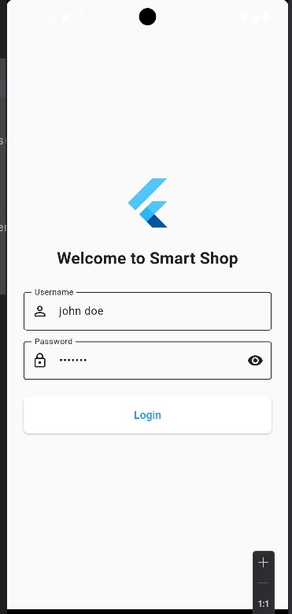
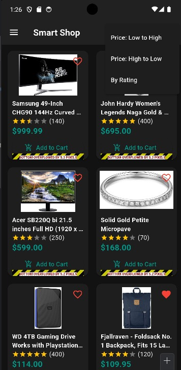
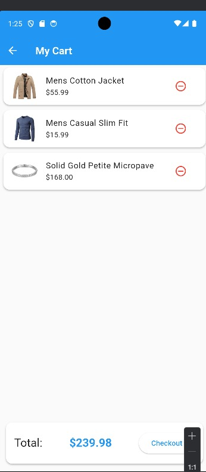
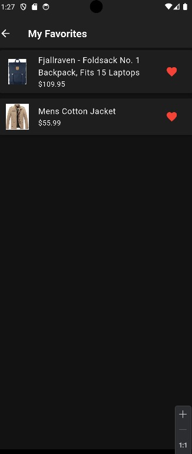
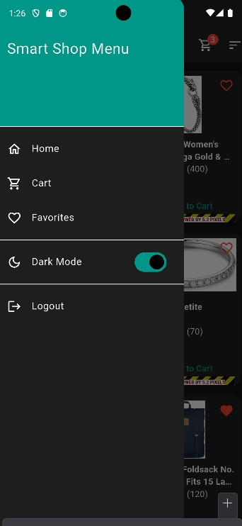

# 🛍️ Smart Shop  
*A modern, full-featured e-commerce mobile application built with Flutter.*

Smart Shop demonstrates a **clean, scalable architecture** using `Provider` for state management, `SharedPreferences` for local persistence, and seamless integration with the **FakeStore RESTful API**.

---

## 📸 Screenshots

### 🔐 Login  


### 🏠 Home (Light)  


### 🌙 Home (Dark)  


### 🛒 Cart (Light)  


### ❤️ Favorites  


### 🧮 Sorting  


### 📂 Shop Menu  


---

## ✨ Features

- **Full Authentication:** Secure login functionality powered by the FakeStore API.  
- **Dynamic Product Catalog:** Displays a real-time grid of products fetched from API.  
- **Pull-to-Refresh:** Reload product list with a simple swipe.  
- **Advanced Product Sorting:** Sort products by:
  - Price (Low to High / High to Low)
  - User Rating  
- **Interactive Shopping Cart:**
  - Add/remove items with real-time total
  - Cart badge updates instantly  
- **Favorites System:**  
  - Mark products as favorite  
  - Persistent favorites across sessions  
- **Theme Toggling:**  
  - Instantly switch between light & dark mode  
  - Saves preference locally  
- **Intuitive Navigation:**  
  - Clean drawer navigation across all main screens  

---

## 🛠️ Core Concepts & Technologies

- **State Management:** `Provider` for efficient, scalable app state control  
- **Local Persistence:** `SharedPreferences` for theme and login status  
- **RESTful API Integration:** Connects to [FakeStore API](https://fakestoreapi.com/)  
- **Navigation & Routing:** Centralized routing via `routes.dart`  

### 🔧 Modern UI/UX Includes:

- Custom reusable widgets  
- Responsive grid and list layouts  
- User feedback via:
  - SnackBars
  - RefreshIndicators
  - Loading spinners  
- External packages:
  - `flutter_rating_bar`
  - `badges`

---

## 📁 Folder Structure

```text
lib/
│
├── core/
│   ├── api/           # API Client & Endpoints
│   ├── themes/        # Light/Dark theme data
│   └── utils/         # Constants & helpers
│
├── features/
│   ├── auth/          # Login, Signup Screens & ViewModels
│   ├── cart/          # Cart logic & UI
│   └── products/      # Product UI, Widgets & ViewModels
│
├── models/            # Data models (e.g., Product, User)
├── providers/         # App-wide Providers (e.g., ThemeProvider)
├── shared/widgets/    # Common widgets (e.g., CustomDrawer)
├── main.dart          # Entry point of the app
└── routes.dart        # Centralized app routing
